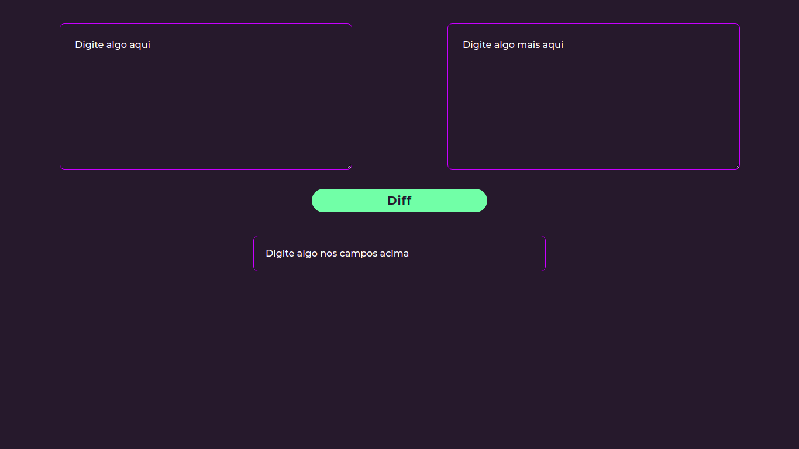
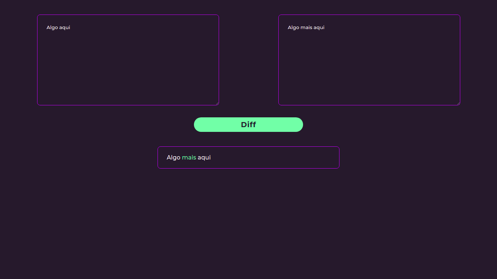
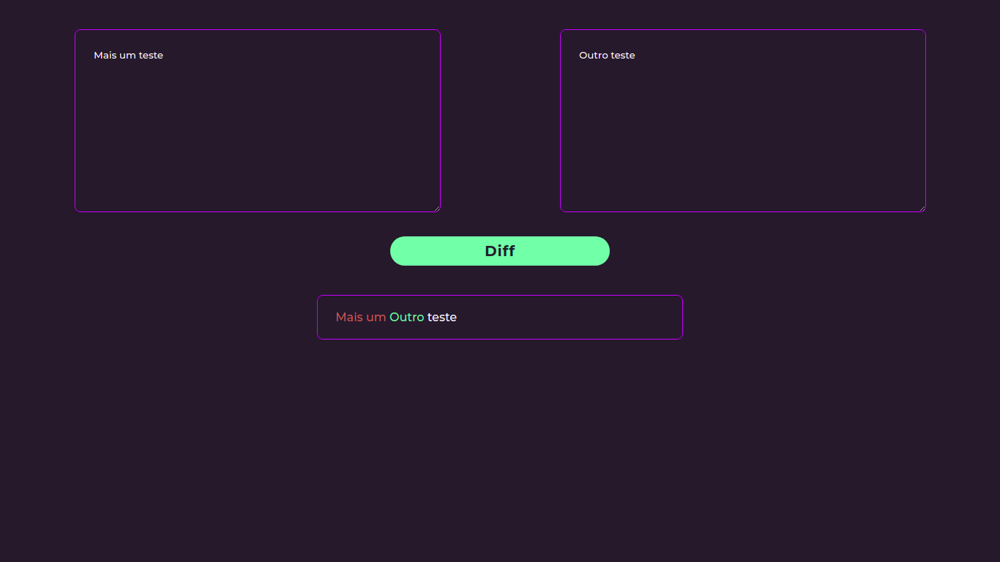

# Diff

**Número da Lista**: 5<br>
**Conteúdo da Disciplina**: Programação Dinâmica<br>

## Alunos
|Matrícula | Aluno |
| -- | -- |
| 18/0016938  |  Gabriel Paiva Aguiar |
| 18/0025601 |  Murilo Gomes de Souza |

## Sobre 
Esse projeto consiste na implementação de um algoritmo que mostra a diferença entre dois textos inseridos, baseado no algorítmo de Maior Subsequência Comum (LCS).

## Screenshots
 <br> <br>
 <br> <br>
 <br> <br>

## Instalação 
**Linguagem**: Typescript<br>
**Framework**: React<br>

Para rodar o projeto, será necessário ter instalado em sua máquina o yarn ou npm

```
https://nodejs.org/en/
```

### Como rodar

1. Clone o projeto na sua máquina:

```
git clone https://github.com/projeto-de-algoritmos/PD_diff
```

2. Entre na pasta do projeto:

```
cd PD_diff/diff
```

3. Instale as dependências do projeto:

```
npm install
```

ou

```
yarn
```


4. Execute o projeto para subir o servidor:

```
npm start
```

ou

```
yarn start
```


5. Acesse o projeto no seu navegador através da url:

```
http://localhost:3000/
```

## Uso 
Para utilizar o projeto, insira textos nos inputs e pressione o botão de "DIFF". A saída será mostrada com a diferença entre os dois textos. Palavra(s) na cor vermelha significam remoção e na cor verde adição. Uma palavra na cor branca não foi modificada.


